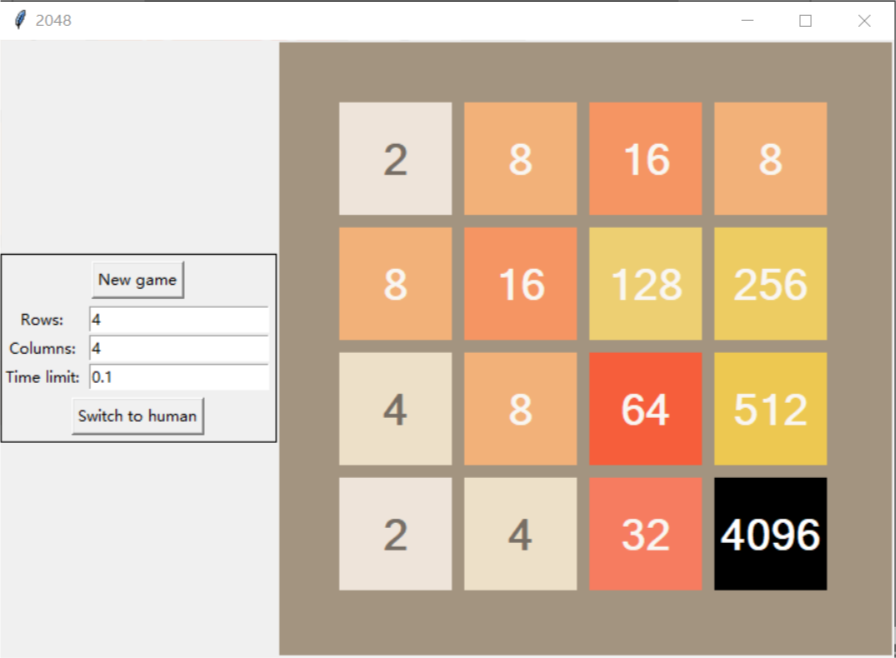

# 2048-ai-tk

## Description
- Minimax with alpha–beta pruning and iterative deepening, ~90% win rate.
- Tkinter GUI, no additional package required on Windows.
- Can switch between automatic and manual modes.

```bash
sudo apt install python3-tk # for Linux
python game.py
```

## Implementation
Modules:
- `grid.py`: Contains class that represents the 2048 board.
- `game.py`: Driver that runs the game in GUI.
- `minimax.py`: Minimax implementation, reusable in other games.
- `player_ai.py`: Minimax for 2048.

Optimizations:
- Order nodes to maximize pruning.
- Memorization in iterative deepening.

Some heuristics:
- available cells
- potential merging
- average, median, max tile
- difference between adjacent tiles
- score and penalty of ordering across rows, columns

---

